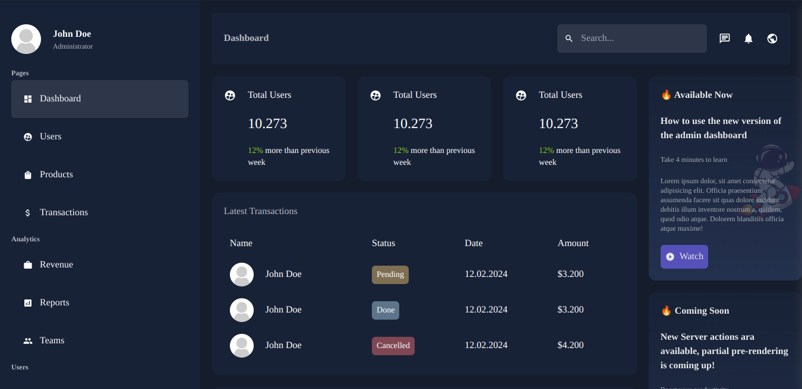

<h2>Dashboard application</h2>
<br >

<hr >

<h4>Description</h4>
Dashboard app built with NextJS with server actions<br >
Feel free to play with it as you wish
<br >

<h4>Installation Guide</h4>
I'll assume you already have <strong>Node</strong> installed.

Start by cloning the repo:

```
https://github.com/bismarkboateng/nextAdmin.git

cd nextAdmin

yarn

yarn dev

```

select the link running on your development server to preview<br>
the application